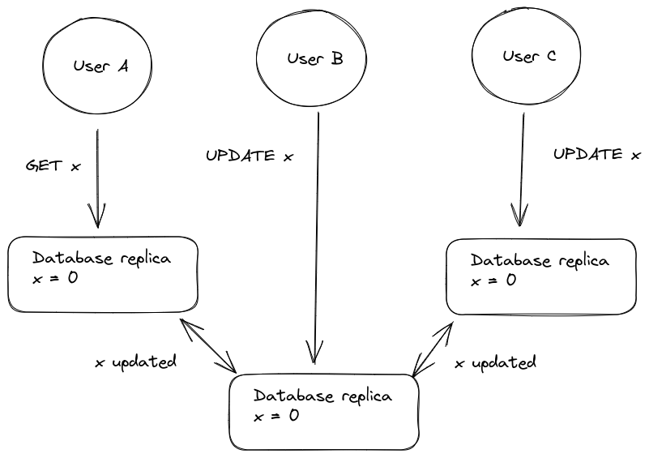
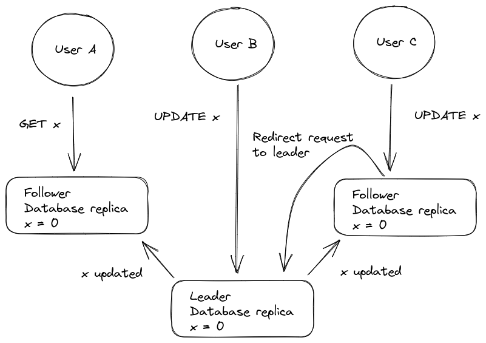
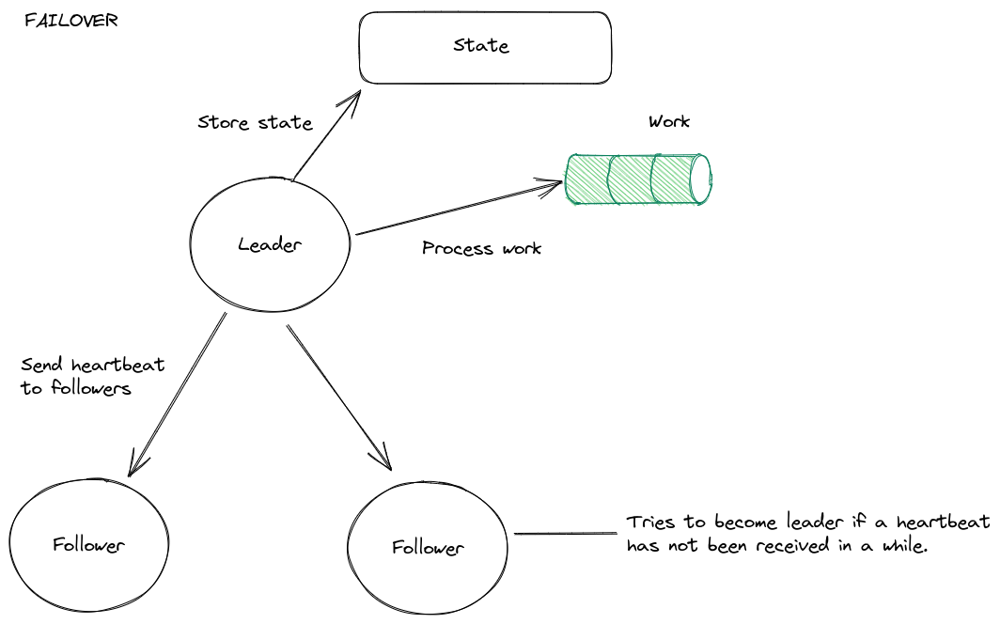
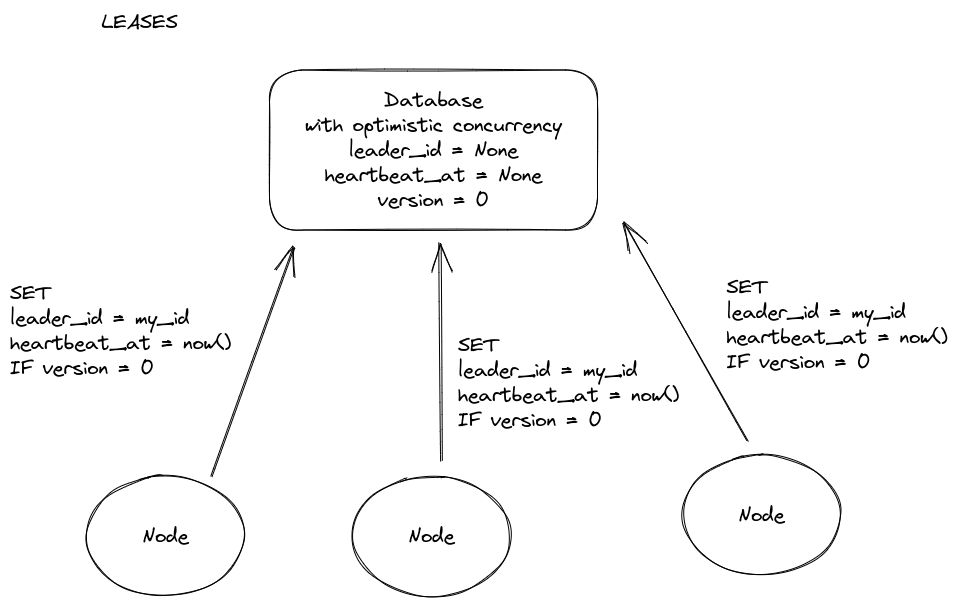
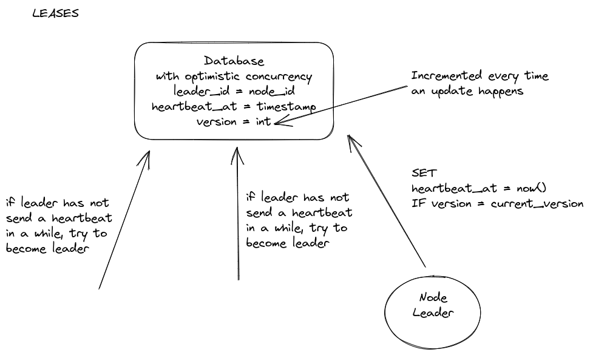
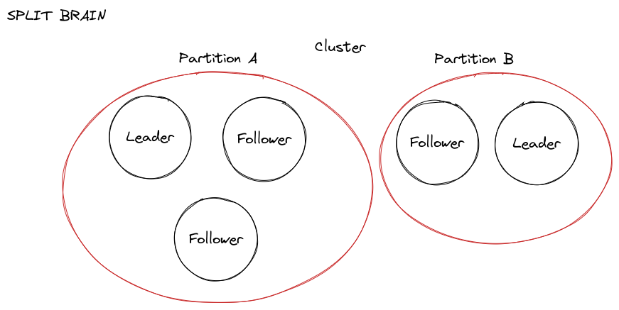

# With a single node

## One resource, several workers

```go
package main

import (
	"fmt"
	"sync"
)

var x int = 0

func main() {
	wg := sync.WaitGroup{}

	for i := 0; i < 3; i += 1 {
		wg.Add(1)

		go worker(&wg)
	}

	// Wait until every worker calls wg.Done().
	wg.Wait()

	fmt.Println("x = %i", x)
}

func worker(wg *sync.WaitGroup) {
	for i := 0; i < 10_000; i += 1 {
		x += 1
	}

	wg.Done()
}
```

## Solution

```go
package main

import (
	"fmt"
	"sync"
)

var x int = 0

func main() {
	wg := sync.WaitGroup{}
	mu := sync.Mutex{}

	for i := 0; i < 3; i += 1 {
		wg.Add(1)

		go worker(&wg, &mu)
	}

	// Wait until every worker calls wg.Done().
	wg.Wait()

	fmt.Println("x = %i", x)
}

func worker(wg *sync.WaitGroup, mu *sync.Mutex) {
	for i := 0; i < 10_000; i += 1 {
		mu.Lock()
		x += 1
		mu.Unlock()
	}

	wg.Done()
}
```

# With several nodes

## What is the value of `x` after the `UPDATE` operations?



## Solution




# Failover



# Leases

## At first, there are no leaders



## A leader must send heartbeats to let the followers know that it is alive



# Split brain



# References

https://learn.microsoft.com/en-us/azure/architecture/patterns/leader-election  
https://aws.amazon.com/builders-library/leader-election-in-distributed-systems/  
https://www.elastic.co/blog/found-leader-election-in-general  